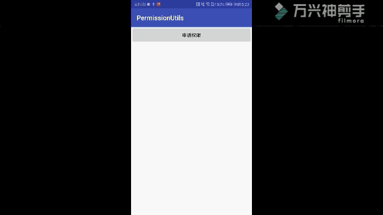
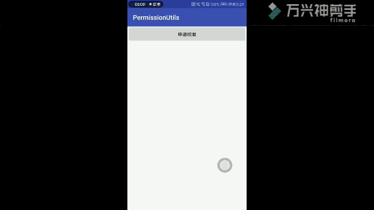

# HuGePermission
一个超级强大的运行时权限工具类，一行代码解决运行时权限
## Github上一些针对于运行时权限处理，单个权限都还好，但是多个权限，我感觉不是特别的完美！不能满足我的业务！所以自己动手封装了一个！
</br>不多BB，直接上效果图
## 全部允许权限

## 部分拒绝和部分永久禁止

## 使用方法很简单，一行代码
## 1.2.0支持AndroidX
</br>1、	Activity中使用运行时权限的Activity extend PermissionActivity；Fragment中使用运行时权限 Fragment extend PermissionFragment
</br>2、重写requestPermission(String...permission)方法
</br>	### 使用依赖
             
                allprojects {
		repositories {
			...
			maven { url 'https://jitpack.io' }
		}
	}
            dependencies {
	        implementation 'com.github.Hu12037102:HuGePermission:1.2.0'
	        implementation 'com.github.Hu12037102:HuGePermission:1.2.5'
	}

```java 
```java
requestPermission(new OnPermissionsResult() {
                              @Override
                              public void onAllow(List<String> permissions) {
                                  Toast.makeText(MainActivity.this,"申请权限成功!",Toast.LENGTH_SHORT).show();
                              }

                              @Override
                              public void onNoAllow(List<String> permissions) {
                                  Toast.makeText(MainActivity.this,"部分权限申请失败，请重新申请",Toast.LENGTH_SHORT).show();
                              }

                              @Override
                              public void onForbid(List<String> permissions) {
                                  showForbidPermissionDialog();

                              }

                          },
                Manifest.permission.ACCESS_FINE_LOCATION,
                Manifest.permission.ACCESS_COARSE_LOCATION,
                Manifest.permission.WRITE_EXTERNAL_STORAGE,
                Manifest.permission.READ_CALENDAR,
                Manifest.permission.READ_CONTACTS,
                Manifest.permission.READ_PHONE_STATE,
                Manifest.permission.READ_SMS,
                Manifest.permission.RECORD_AUDIO,
                Manifest.permission.CAMERA,
                Manifest.permission.CALL_PHONE,
                Manifest.permission.SEND_SMS); 
 java```
		
                Manifest.permission.SEND_SMS);
		```
	
            

